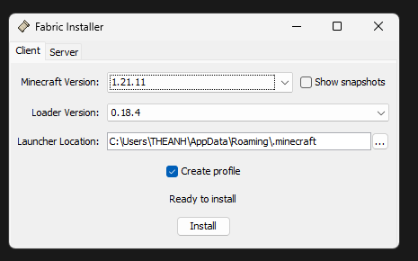
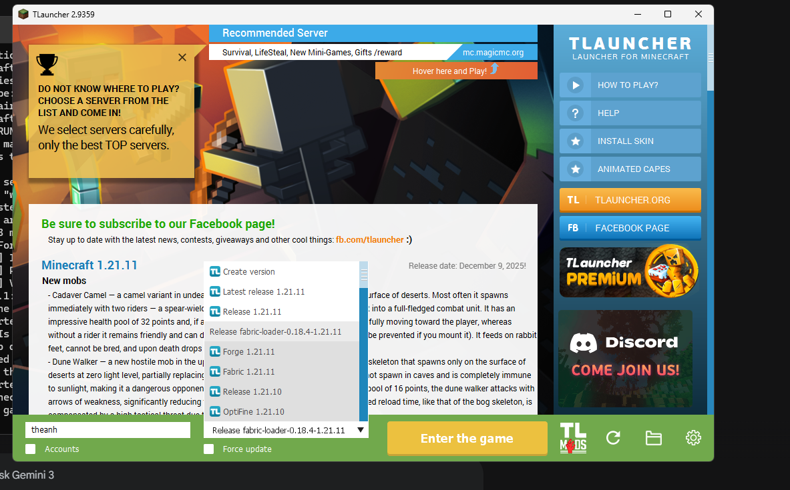

# 🛠️ Server Setup Guide

Follow these steps to configure your client and join the server.

### 1. Install the Launcher
Download and install **TLauncher**.

> ⚠️ **IMPORTANT WARNING:** > During installation, TLauncher may try to install "Opera GX" or other bloatware.  
> **Uncheck the boxes** or click **"Deny"** to avoid installing this unwanted software.

### 2. Install Fabric
You need the Fabric loader to run our mods.
* Open the Fabric installer.
* Ensure the settings match the screenshot below (pay attention to the Minecraft version and Loader version).

### 3. Sync Mods
We use a script to automatically download the correct mods and configs.
* Locate the file `sync-mods.bat` in your folder.
* Double-click it to run the synchronization process.

### 4. Launch the Game
* Open TLauncher.
* In the version dropdown list, select the profile labeled **Fabric-Release** (or the specific version you just installed).
* Click **Enter the Game**.

### 5. Connect to the Server
1.  Go to **Multiplayer** > **Add Server**.
2.  **Server Name:** You can name it whatever you want (e.g., "My SMP").
3.  **Server Address:**
    * Go to our Discord music bot.
    * Type the command: `!minecraft`
    * The bot will reply with the current IP address.
    
    > *Note: If the bot does not reply or says offline, the server is currently down.*